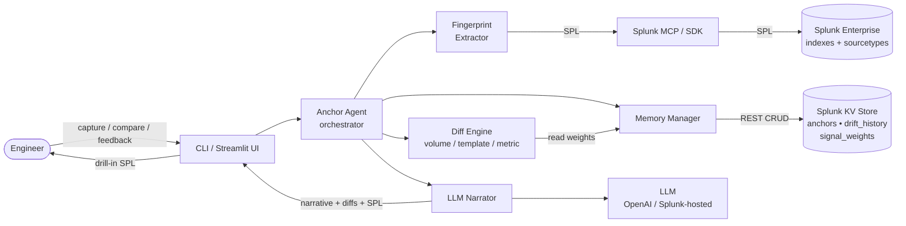
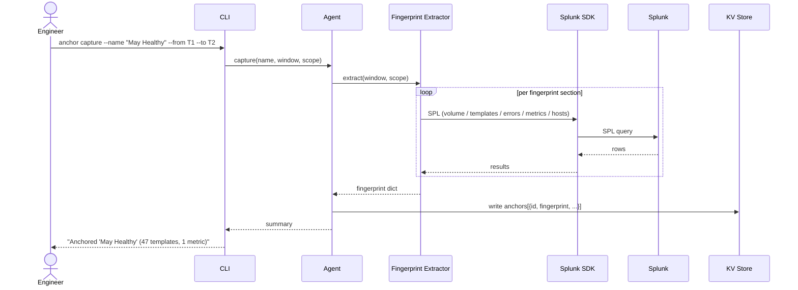
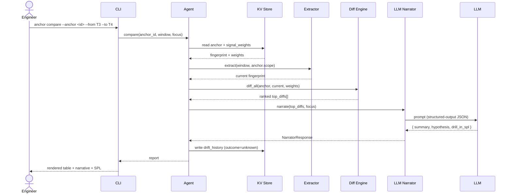
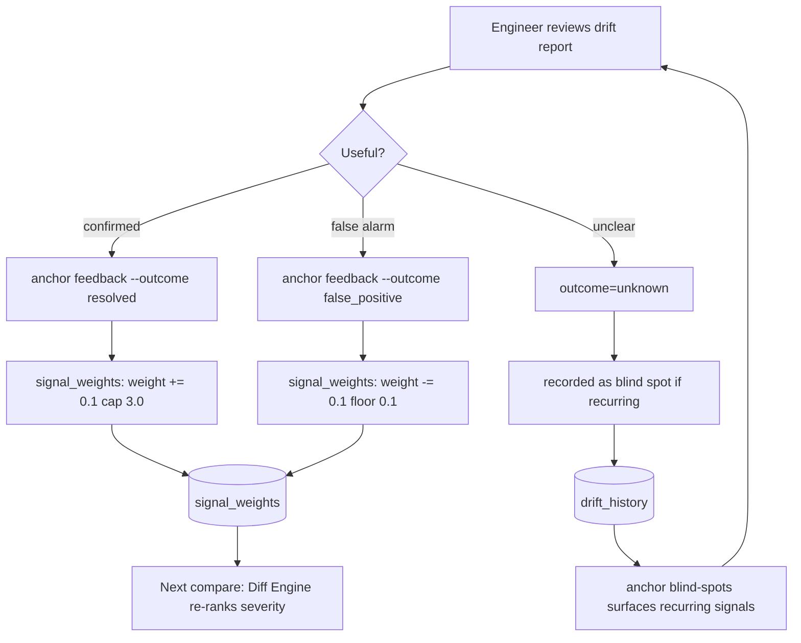
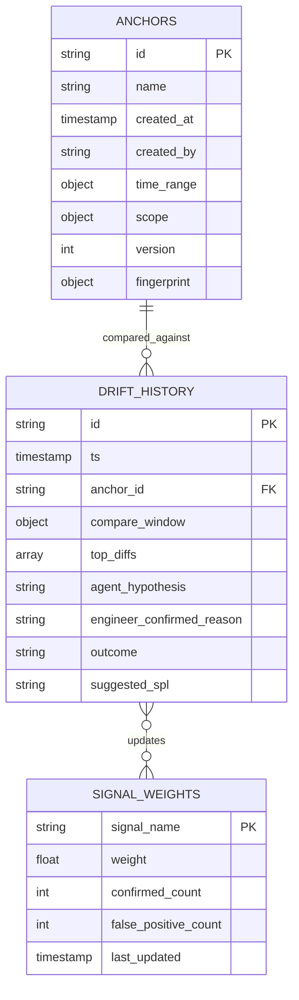

# Architecture

## System overview

```mermaid
flowchart LR
    User([Engineer])
    CLI[CLI / Streamlit UI]
    Agent[Anchor Agent<br/>orchestrator]
    FP[Fingerprint<br/>Extractor]
    Diff[Diff Engine<br/>volume / template / metric]
    Narr[LLM Narrator]
    Mem[Memory Manager]
    MCP[Splunk MCP / SDK]
    LLM[LLM<br/>OpenAI / Splunk-hosted]
    Splunk[(Splunk Enterprise<br/>indexes + sourcetypes)]
    KV[(Splunk KV Store<br/>anchors • drift_history<br/>signal_weights)]

    User -->|capture / compare / feedback| CLI
    CLI --> Agent
    Agent --> FP
    Agent --> Diff
    Agent --> Narr
    Agent --> Mem
    FP -->|SPL| MCP
    Diff -->|read weights| Mem
    Narr --> LLM
    Mem -->|REST CRUD| KV
    MCP -->|SPL| Splunk
    Narr -->|narrative + diffs + SPL| CLI
    CLI -->|drill-in SPL| User
```

## ANCHOR mode — sequence

```mermaid
sequenceDiagram
    actor Eng as Engineer
    participant CLI
    participant Agent
    participant FP as Fingerprint Extractor
    participant MCP as Splunk SDK
    participant Splunk
    participant KV as KV Store

    Eng->>CLI: anchor capture --name "May Healthy" --from T1 --to T2
    CLI->>Agent: capture(name, window, scope)
    Agent->>FP: extract(window, scope)
    loop per fingerprint section
        FP->>MCP: SPL (volume / templates / errors / metrics / hosts)
        MCP->>Splunk: SPL query
        Splunk-->>MCP: rows
        MCP-->>FP: results
    end
    FP-->>Agent: fingerprint dict
    Agent->>KV: write anchors[{id, fingerprint, ...}]
    Agent-->>CLI: summary
    CLI-->>Eng: "Anchored 'May Healthy' (47 templates, 1 metric)"
```

## COMPARE mode — sequence

```mermaid
sequenceDiagram
    actor Eng as Engineer
    participant CLI
    participant Agent
    participant KV as KV Store
    participant FP as Extractor
    participant Diff as Diff Engine
    participant Narr as LLM Narrator
    participant LLM

    Eng->>CLI: anchor compare --anchor <id> --from T3 --to T4
    CLI->>Agent: compare(anchor_id, window, focus)
    Agent->>KV: read anchor + signal_weights
    KV-->>Agent: fingerprint + weights
    Agent->>FP: extract(window, anchor.scope)
    FP-->>Agent: current fingerprint
    Agent->>Diff: diff_all(anchor, current, weights)
    Diff-->>Agent: ranked top_diffs[]
    Agent->>Narr: narrate(top_diffs, focus)
    Narr->>LLM: prompt (structured-output JSON)
    LLM-->>Narr: { summary, hypothesis, drill_in_spl }
    Narr-->>Agent: NarratorResponse
    Agent->>KV: write drift_history (outcome=unknown)
    Agent-->>CLI: report
    CLI-->>Eng: rendered table + narrative + SPL
```

## Evolution loop

```mermaid
flowchart TD
    A[Engineer reviews drift report] --> B{Useful?}
    B -- confirmed --> C[anchor feedback --outcome resolved]
    B -- false alarm --> D[anchor feedback --outcome false_positive]
    B -- unclear --> E[outcome=unknown]
    C --> F[signal_weights: weight += 0.1 cap 3.0]
    D --> G[signal_weights: weight -= 0.1 floor 0.1]
    E --> H[recorded as blind spot if recurring]
    F --> KV[(signal_weights)]
    G --> KV
    H --> KV2[(drift_history)]
    KV --> I[Next compare: Diff Engine re-ranks severity]
    KV2 --> J[anchor blind-spots surfaces recurring signals]
    J --> A
```

## KV Store schema

```mermaid
erDiagram
    ANCHORS ||--o{ DRIFT_HISTORY : "compared_against"
    DRIFT_HISTORY }o--o{ SIGNAL_WEIGHTS : "updates"
    ANCHORS {
        string id PK
        string name
        timestamp created_at
        string created_by
        object time_range
        object scope
        int version
        object fingerprint
    }
    DRIFT_HISTORY {
        string id PK
        timestamp ts
        string anchor_id FK
        object compare_window
        array top_diffs
        string agent_hypothesis
        string engineer_confirmed_reason
        string outcome
        string suggested_spl
    }
    SIGNAL_WEIGHTS {
        string signal_name PK
        float weight
        int confirmed_count
        int false_positive_count
        timestamp last_updated
    }
```
