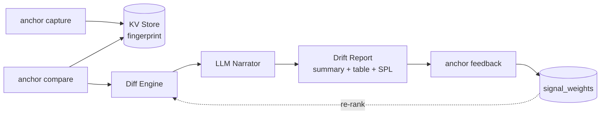
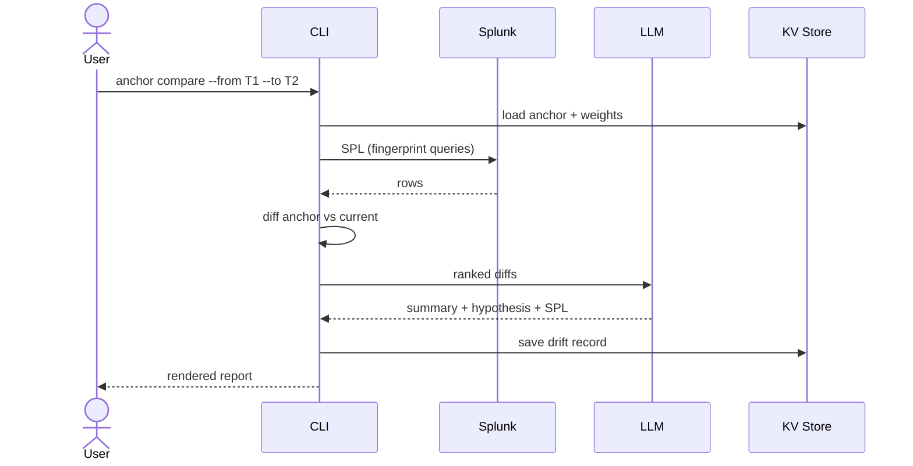

# Anchor

**Healthy-baseline drift agent for Splunk.**

Capture a "golden fingerprint" of a time window when your system was healthy.
Later, compare any window against it and get a plain-English narrative of what
drifted, why it matters, and which SPL to run next.


---

## Why

Existing Splunk anomaly tooling trains on *recent* history that may already
be drifted. Anchor fixes a **human-curated healthy window** as ground truth
and reuses it indefinitely — even after raw logs age out of retention.

A chatbot prompt answers "is this weird?" once. Anchor turns that into a
**named, shared, versioned artifact** your whole team returns to.

---

## Workflow



## Compare lifecycle



---

## Features

- **`anchor capture`** — fingerprint a window (volume, log templates, error rates, metric percentiles, top hosts) and persist to Splunk KV Store.
- **`anchor compare`** — diff a target window against an anchor; LLM-narrated report with a ranked top-diffs table and suggested drill-in SPL.
- **`anchor feedback`** — record outcome; signal weights auto-adjust to re-rank future severity.
- **`anchor history`** / **`anchor blind-spots`** — surface recurring unresolved signals as institutional knowledge.

---

## Quick start

### 1. Bring up a Splunk sandbox (Docker)

```bash
docker compose up -d                  # Splunk Enterprise on :8000 (Web) :8089 (API)
# Wait ~60s for first-boot init, then login at http://localhost:8000
#   user: admin   password: Anchor!Demo2026
```

Native install? See [docs.splunk.com](https://docs.splunk.com/Documentation/Splunk/latest/Installation/InstallonLinux)
— `.env.example` defaults assume the Docker container.

### 2. Install Anchor

```bash
python -m venv .venv && source .venv/bin/activate
pip install -e .
cp .env.example .env                  # fill in Qwen or Gemini API key
```

### 3. Seed and ingest demo data

```bash
python examples/seed_data.py          # writes examples/data/{healthy,drifted}.log

# Note: -u splunk is required — docker exec defaults to root, which cannot
# write to splunk-owned paths inside the container (esp. on Docker Desktop).
docker exec -u splunk anchor-splunk /opt/splunk/bin/splunk add oneshot /seed/healthy.log \
  -index main -sourcetype _json -auth 'admin:Anchor!Demo2026'
docker exec -u splunk anchor-splunk /opt/splunk/bin/splunk add oneshot /seed/drifted.log \
  -index main -sourcetype _json -auth 'admin:Anchor!Demo2026'
```

### 4. Run

```bash
anchor capture --name "Healthy Week" \
  --from 2026-05-20T00:00:00 --to 2026-05-27T00:00:00 \
  --index main --metric latency_ms

anchor compare \
  --from 2026-06-02T00:00:00 --to 2026-06-03T00:00:00 \
  --focus "checkout slowness"

anchor feedback <drift_id> --outcome resolved --reason "payment-svc rollback"

anchor history --unresolved
anchor blind-spots
```

Tear down the sandbox when done: `docker compose down -v`.

See [ARCHITECTURE.md](ARCHITECTURE.md) for full diagrams and
[examples/demo_script.md](examples/demo_script.md) for the timed demo flow.

---

## License

[MIT](LICENSE)
