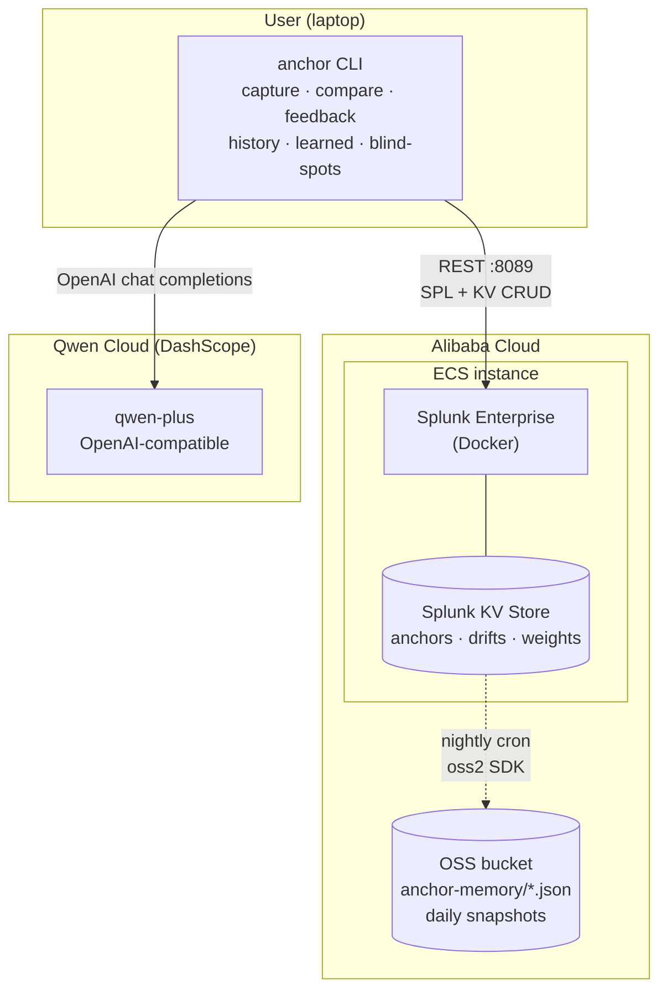
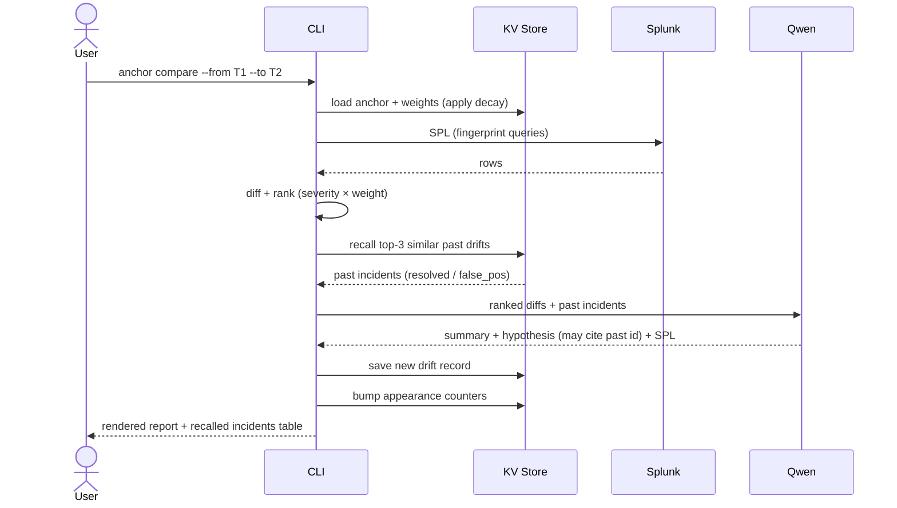

# Anchor

**A MemoryAgent for SRE incident response — built on Splunk + Qwen.**

Capture a "golden fingerprint" of a time window when your system was healthy.
Later, compare any window against it and get a plain-English narrative of what
drifted, why it matters, and which SPL to run next — *informed by what the
agent learned from every past investigation.*


---

## Why a MemoryAgent

Every on-call engineer has had this moment: an incident hits, you open Splunk,
and you waste the first 15–20 minutes asking *"wait — what does normal even
look like for this service?"*

Existing anomaly tooling trains on *recent* history that may already be drifted.
A chatbot prompt answers *"is this weird?"* once — then evaporates.

**Anchor remembers three things, persistently:**

| Memory | Stored as | What it does |
|---|---|---|
| What "healthy" looked like | `anchors` in Splunk KV Store | Lets any future investigation diff against a *human-curated* baseline, not yesterday's already-drifted data. Survives raw-log retention. |
| Which signals actually matter | `signal_weights` | Re-ranks diffs based on accumulated feedback. Confirmed signals weigh more; false-positive signals weigh less; both decay toward neutral over time (*timely forgetting*). |
| What we did about it last time | `drift_history` | On every compare, the most similar past resolved drifts are recalled and fed into the LLM as evidence ("incident `7db2d8aa` had the same fingerprint — payment-svc rollback fixed it"). |

The result: a Splunk drift agent that gets sharper across sessions, with a
deterministic core and an LLM only at the narration layer.

---

## System overview



> **MemoryAgent loop**: each `compare` reads `signal_weights` (learned ranking)
> and `drift_history` (recalled past incidents) before calling the LLM, then
> writes a new drift record. Each `feedback` updates `signal_weights`.
> Weights silently decay toward 1.0 over ~30 days to forget stale opinions.

## Compare lifecycle (with memory)



---

## Features

- **`anchor capture`** — fingerprint a window (volume, log templates, error rates, metric percentiles, top hosts) and persist to Splunk KV Store.
- **`anchor compare`** — diff a target window against an anchor; LLM-narrated report with a ranked top-diffs table, suggested drill-in SPL, **and a "recalled past incidents" table** showing the most-similar resolved drifts the agent pulled into the LLM context.
- **`anchor compare --deep`** — same compare, then drive Qwen's *function-calling* planner through a ReAct loop (recall → drill-in SPL → re-recall → conclude) and print each step live. Default cap 6 tool calls; tunable with `--max-steps`.
- **`anchor feedback`** — record outcome; signal weights auto-adjust to re-rank future severity (confirmed signals get +10%, false positives get −20%).
- **`anchor learned`** — introspect Anchor's memory: which signals have been re-weighted, which are decaying back to neutral.
- **`anchor history`** / **`anchor blind-spots`** — surface past drift records and signals that recur unresolved.
- **`anchor delete-drift <id>`** / **`anchor purge-drifts [--outcome ...]`** — prune history (e.g. after a stale demo) without touching anchors or weights.

### Qwen Cloud integration surfaces

Anchor exposes its memory loop on **three** Qwen-compatible surfaces from a single backend — so the same SPL/KV layer drives the CLI, conversational MCP clients, and Qwen Cloud's Application Center.

| Surface | Entrypoint | When to use |
|---|---|---|
| **CLI** | `anchor …` | On-call engineer at a terminal. |
| **MCP server (stdio)** | `pip install -e '.[mcp]' && anchor-mcp` | Drive Anchor from Claude Desktop, Cursor, or any MCP client — 8 tools (`anchor.compare`, `anchor.deep_compare`, `anchor.recall`, …). |
| **Custom Skill (HTTP)** | `pip install -e '.[skill]' && uvicorn anchor.skill_server:app` | Register the [`deploy/qwen_skill/anchor-skill.yaml`](deploy/qwen_skill/anchor-skill.yaml) OpenAPI spec in Qwen Cloud → Application Center; bearer-auth shim runs on ECS. |

Semantic recall (Qwen `text-embedding-v3`) is opt-in: set `ANCHOR_SEMANTIC_RECALL=1` and embeddings are persisted alongside each drift, so future recalls use cosine similarity in addition to Jaccard.

### MemoryAgent alignment

| Track-1 capability | Anchor implementation |
|---|---|
| **Persistent memory** | `anchors`, `drift_history`, `signal_weights` collections in Splunk KV Store. Survives raw-log retention; survives ECS reboots; nightly backups to Alibaba Cloud OSS. |
| **Accumulates experience** | `anchor feedback` mutates `signal_weights` after every confirmed outcome. |
| **More accurate decisions across sessions** | Each compare ranks diffs by `severity × weight`. Signals confirmed in past drifts surface higher; false-positive signals get suppressed. |
| **Timely forgetting of outdated information** | `decay_weights()` pulls weights halfway back to 1.0 every 30 days of inactivity. Lazy-applied on `get_weights()`. |
| **Recalling critical memories within limited context** | `recall_similar_drifts()` Jaccard-ranks past resolved drifts by signal overlap, top-3 fed into the LLM as `past_incidents`. Bounded — never blows the context window. |

---

## Quick start

### 1. Bring up a Splunk sandbox (Docker)

```bash
docker compose up -d                  # Splunk Enterprise on :8000 (Web) :8089 (API)
# Wait ~60s for first-boot init, then login at http://localhost:8000
#   user: admin   password: Anchor!Demo2026
```

Native install? See [docs.splunk.com](https://docs.splunk.com/Documentation/Splunk/latest/Installation/InstallonLinux)
— `.env.example` defaults assume the Docker container.

### 2. Install Anchor

```bash
python -m venv .venv && source .venv/bin/activate
pip install -e .
cp .env.example .env                  # fill in Qwen or Gemini API key
```

### 3. Seed and ingest demo data

```bash
python examples/seed_data.py          # writes examples/data/{healthy,drifted}.log

# Note: -u splunk is required — docker exec defaults to root, which cannot
# write to splunk-owned paths inside the container (esp. on Docker Desktop).
docker exec -u splunk anchor-splunk /opt/splunk/bin/splunk add oneshot /seed/healthy.log \
  -index main -sourcetype _json -auth 'admin:Anchor!Demo2026'
docker exec -u splunk anchor-splunk /opt/splunk/bin/splunk add oneshot /seed/drifted.log \
  -index main -sourcetype _json -auth 'admin:Anchor!Demo2026'
```

### 4. Run

```bash
anchor capture --name "Healthy Week" \
  --from 2026-05-20T00:00:00 --to 2026-05-27T00:00:00 \
  --index main --metric latency_ms

anchor compare \
  --from 2026-06-02T00:00:00 --to 2026-06-03T00:00:00 \
  --focus "checkout slowness"

# Same window, but let Qwen's function-calling planner drill in with tools.
anchor compare --deep \
  --from 2026-06-02T00:00:00 --to 2026-06-03T00:00:00 \
  --focus "checkout slowness"

anchor feedback <drift_id> --outcome resolved --reason "payment-svc rollback"

# Memory introspection — what has the agent learned?
anchor learned

anchor history --unresolved
anchor blind-spots
```

Tear down the sandbox when done: `docker compose down -v`.

For the Alibaba-Cloud-hosted backend (Splunk on ECS + KV memory backups to OSS),
see [deploy/alibaba-cloud.md](deploy/alibaba-cloud.md).

See [examples/demo_script.md](examples/demo_script.md) for the timed demo flow.

---

## License

[MIT](LICENSE)
