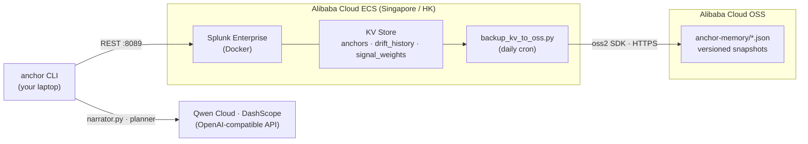

# Alibaba Cloud deployment

This is the production deployment for Anchor's backend (Splunk + KV Store).
Following these steps satisfies the Qwen Cloud hackathon's
**"backend running on Alibaba Cloud"** requirement and demonstrates active
use of Alibaba Cloud services and APIs (ECS + OSS).

## TL;DR (3 commands)

After provisioning ECS + opening ports 22/8089 in the console:

```bash
# on the ECS host, as root
curl -fsSL https://raw.githubusercontent.com/faketut/Anchor/main/deploy/setup_ecs.sh | bash
nano /opt/anchor/.env   # fill in SPLUNK_PASSWORD, QWEN_API_KEY, OSS_* creds
bash /opt/anchor/deploy/verify_setup.sh
```

The script is idempotent — safe to re-run after editing `.env`. If you
prefer step-by-step, the long-form walkthrough is below.

## Architecture



## 1. Provision ECS

| Setting | Value |
|---|---|
| Instance type | `ecs.g7.large` (2 vCPU, 8 GB) |
| Region | Singapore (`ap-southeast-1`) or Hong Kong (`cn-hongkong`) |
| OS image | Ubuntu 24.04 LTS |
| System disk | 60 GB ESSD (Splunk needs headroom) |
| Bandwidth | Pay-by-traffic, 5 Mbps peak |

Security group inbound rules:

| Port | Source | Reason |
|---|---|---|
| 22  | your laptop's public IP / 32 | SSH |
| 8089 | your laptop's public IP / 32 | Anchor CLI → Splunk mgmt API |

> Splunk Web (8000) is **not** opened to the public — we tunnel it over SSH
> when we need the UI. This keeps the admin login off the internet.

## 2. Install Docker on ECS

```bash
ssh root@<ecs-public-ip>
apt-get update && apt-get install -y docker.io docker-compose-v2 git python3-venv
systemctl enable --now docker
```

## 3. Clone Anchor and bring up Splunk

```bash
cd /opt
git clone https://github.com/faketut/Anchor.git anchor
cd anchor

docker compose \
  -f docker-compose.yml \
  -f deploy/docker-compose.alibaba.yml \
  up -d

# wait ~60s for first boot, then install KV schema:
docker exec -u splunk anchor-splunk mkdir -p /opt/splunk/etc/apps/search/local
docker cp splunk/collections.conf anchor-splunk:/opt/splunk/etc/apps/search/local/collections.conf
docker exec -u root   anchor-splunk chown splunk:splunk /opt/splunk/etc/apps/search/local/collections.conf
docker exec -u splunk anchor-splunk /opt/splunk/bin/splunk restart
```

Verify:

```bash
curl -k https://localhost:8089/services/server/info | head
```

## 4. Install Anchor CLI on ECS (for the OSS backup cron)

```bash
cd /opt/anchor
python3 -m venv .venv
source .venv/bin/activate
pip install -e '.[alibaba]'
cp .env.example .env
# Edit .env: set SPLUNK_PASSWORD and QWEN_API_KEY
```

## 5. Create OSS bucket for memory backups

In the Alibaba Cloud console → OSS → Create Bucket:

| Setting | Value |
|---|---|
| Name | `anchor-memory-backups-<your-suffix>` (must be globally unique) |
| Region | Same as ECS |
| ACL | Private |
| Versioning | Enabled (so we never lose a backup) |

Create a RAM user with **AliyunOSSFullAccess** scoped to this bucket, save
its AccessKey ID + Secret.

## 6. Set the OSS env vars on ECS

Append to `/opt/anchor/.env` (or use systemd EnvironmentFile):

```bash
OSS_ACCESS_KEY_ID=LTAI...
OSS_ACCESS_KEY_SECRET=...
OSS_ENDPOINT=oss-ap-southeast-1.aliyuncs.com
OSS_BUCKET=anchor-memory-backups-<your-suffix>
```

Smoke test:

```bash
cd /opt/anchor
set -a; source .env; set +a
.venv/bin/python deploy/backup_kv_to_oss.py
# expected: "Snapshot: {...}"  then  "Uploaded oss://<bucket>/anchor-memory/<ts>.json"
```

## 7. Schedule daily backup

```bash
crontab -e
# Add:
0 3 * * * cd /opt/anchor && set -a; . ./.env; set +a; .venv/bin/python deploy/backup_kv_to_oss.py >> /var/log/anchor-backup.log 2>&1
```

## 8. Point your laptop's Anchor CLI at the ECS Splunk

On your **laptop** (`.env` in your local clone):

```bash
SPLUNK_HOST=<ecs-public-ip>
SPLUNK_PORT=8089
SPLUNK_USERNAME=admin
SPLUNK_PASSWORD=<same as ECS .env>
SPLUNK_SCHEME=https
SPLUNK_VERIFY_SSL=false
```

> **⚠ Production hardening (out of scope for the hackathon demo, do this for any real workload):**
> - Set `SPLUNK_VERIFY_SSL=true` and front Splunk 8089 with a reverse proxy
>   (Nginx / Caddy) plus a real Let's Encrypt certificate. The default
>   `false` accepts Splunk's self-signed cert and is fine **only** for the
>   judge-facing demo.
> - **Rotate the OSS RAM AccessKey every 90 days** and grant it write
>   permission only on the specific bucket (custom RAM policy), not the
>   blanket `AliyunOSSFullAccess` used in section 6.

`anchor list` from your laptop now talks to Splunk running on ECS.

## 9. SSH tunnel for Splunk Web (when needed)

```bash
ssh -L 8000:localhost:8000 root@<ecs-public-ip>
# in another terminal:
open http://localhost:8000   # admin / <SPLUNK_PASSWORD>
```

---

## Hackathon submission checklist

- [ ] ECS instance running, public IP recorded
- [ ] OSS bucket created and contains at least one `anchor-memory/*.json` object
- [ ] `deploy/backup_kv_to_oss.py` committed to repo (it's the proof file
      the rules require — link to it from the Devpost form)
- [ ] ~30 sec proof video shows: ECS console → ssh → `docker ps` →
      `curl https://localhost:8089/services/server/info` → OSS console
      showing the backup objects
